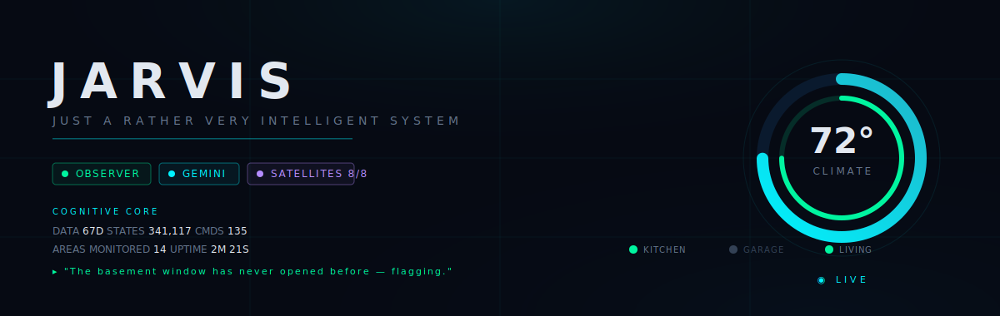
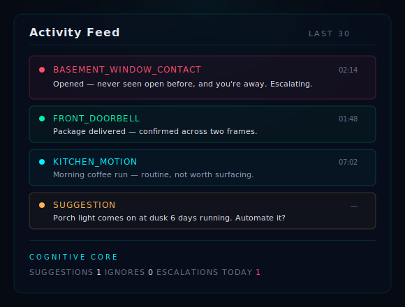
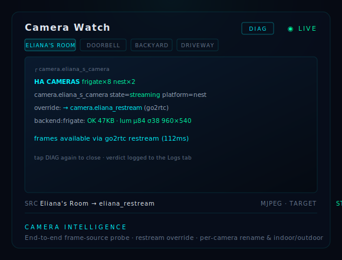

<div align="center">

# JARVIS AI Assistant

### *Just A Rather Very Intelligent System*

An autonomous AI butler for Home Assistant — voice, vision, and a reasoning core that learns your home and watches over it.



[](https://github.com/sam3gp8/jarvis-aio)
[](https://github.com/sam3gp8/jarvis-aio/releases)
[](LICENSE)
[](https://www.buymeacoffee.com/sam3gp8)

</div>

---

JARVIS turns Home Assistant into a proactive household intelligence. It speaks in a custom voice, sees through your cameras, reasons about what's worth telling you, and quietly learns the rhythms of your home over weeks and months. It installs as a Home Assistant **custom integration** via HACS and runs entirely inside Home Assistant — no separate container.

The guiding principle is **suggest, don't act** until you grant otherwise: JARVIS starts conservative, surfaces what it notices, and expands its autonomy only as you allow.

## What it does

**Voice & conversation.** A pluggable LLM brain (Groq, Gemini, OpenAI, Anthropic, or a local Ollama server) drives natural conversation through the Home Assistant voice pipeline, answered in a custom Piper TTS voice. Works with ESP32-S3 satellites, Wyoming, and Google speakers.

**Web research & schedule awareness.** Ask JARVIS about the outside world — current events, facts, "what's the latest on…" — and it looks it up (DuckDuckGo Instant Answer out of the box, no API key; point it at a self-hosted SearXNG for richer results). It also reads your household `calendar.*` entities to surface upcoming events and flag scheduling conflicts — overlaps, and back-to-back commitments with too little gap between them.

**Answers from your own paperwork.** Drop appliance manuals and receipts (PDF, `.txt`, `.md`) into `/config/jarvis/documents`, and JARVIS ingests, chunks, and embeds them into its vector store. Then ask "what's the filter size for the furnace?" or "when did we buy the dishwasher?" and it answers from your documents, citing the source — no more digging through a drawer of manuals.

**The JARVIS voice.** Modelled on Stark's JARVIS: dry, precise, unflappable, quietly witty — and strictly situational about it. The wit is a scalpel, not a hammer, and it goes silent the instant something is wrong. JARVIS does not quip during a smoke alarm. A **banter level** setting (plain / dry / full) tunes how much character surfaces, and urgent and grave events always speak plainly regardless.

**Vision & cameras.** Automatic doorbell-press analysis with a two-pass live-clip / recorded-event approach, package and mail detection on porch cameras, and silent visitor learning that quietly builds a picture of who comes and goes — all powered by vision models reasoning over Nest and Frigate feeds.

**The Cognitive Core.** A reasoning loop that classifies every household event by urgency and decides whether it's worth your attention. It grounds decisions in your home's actual history ("the kitchen light at 7am is routine; the basement window has never opened before"), escalates security-relevant events when you're away, and proposes automations from patterns it observes.

**The Local Mind.** When the cloud is unreachable, JARVIS doesn't go dumb — an offline reasoning brain replicates the full decision procedure (self-awareness, historical grounding, case-based memory, situational judgment, persona phrasing) so it keeps making sound, well-spoken calls with no internet at all.

**Safety & security.** Proactive monitoring for freezing pipes, smoke/CO/water, unauthorized entry, and nighttime lockdown — occupancy-gated so enforcement only happens when it should.

**An Iron Man HUD dashboard.** A dark-cyan glassmorphism control panel with a live isometric 3D house, per-room occupancy glow, radial telemetry gauges, an event feed, a doorbell-training view, and surfaced automation suggestions.

<div align="center">
<table border="0">
<tr>
<td width="50%"></td>
<td width="50%"></td>
</tr>
<tr>
<td align="center"><em>The Cognitive Core classifies every event by urgency — escalating the anomalous, muting the routine.</em></td>
<td align="center"><em>Camera intelligence: per-camera diagnostics, go2rtc restream override, rename &amp; indoor/outdoor designation.</em></td>
</tr>
</table>

<sub>Visuals reflect the panel's actual design system. The live dashboard renders in your browser inside Home Assistant.</sub>
</div>

## Requirements

- **Home Assistant** with [HACS](https://hacs.xyz) installed. HA OS / Supervised is recommended — the optional voice-stack auto-setup (Piper / Whisper / openWakeWord) uses the Supervisor; on HA Container/Core you'd add those yourself.
- At least one **LLM API key** (Groq has a generous free tier and is the recommended starting point).
- *Optional but recommended:* a Gemini API key for camera/vision reasoning, Nest cameras + doorbell, Frigate NVR, ESP32-S3 voice satellites, and a Piper TTS voice.
- *For fully local inference:* a GPU box running Ollama (e.g. via a HAOS GPU AI setup) — point `llm_base_url` at it and JARVIS runs entirely on your own hardware, no cloud account required.

### Nest cameras (prerequisite for camera intelligence)

JARVIS consumes Nest cameras and doorbells **through the official [Google Nest integration](https://www.home-assistant.io/integrations/nest/)** — it does not (and legally cannot) talk to Google's Smart Device Management API with its own credentials, because Google binds SDM access to *your* Google account and Device Access project. One-time setup:

1. **Google SDM API** — create a project in the [Device Access Console](https://console.nest.google.com/device-access) (US $5 one-time fee) and a Google Cloud project with the SDM API enabled and OAuth credentials.
2. **Credentials in HA** — add your OAuth Client ID + Secret under *Settings → Devices & Services → Application Credentials*, then add the **Google Nest** integration and authorize it. Your cameras and doorbell appear as `camera.*` entities.
3. **That's it for JARVIS** — it auto-detects Nest-platform cameras and uses the right frame source for each event (event media, stream-wake, or its own snapshot path). Battery/WebRTC-only Nest cameras can't produce ordinary still images while idle; the JARVIS panel handles this automatically by escalating to its own snapshot tier, so the tile shows frames instead of going blank.

### Continuous streaming for Google Nest cameras (recommended)

Google's SDM API hands out **WebRTC/RTSP stream URLs that expire every ~5 minutes** and won't reliably produce a still image while a camera is idle. That's fine for the occasional glance, but it means live tiles can stall and 24/7 NVR recording (Frigate) chokes. The durable fix — and the one JARVIS is built to lean on — is to **restream each Nest camera through [go2rtc](https://github.com/AlexxIT/go2rtc)**, which speaks Google's SDM protocol natively, transparently renews the expiring stream, and republishes a rock-solid RTSP/WebRTC feed that Home Assistant, Frigate, and JARVIS all consume like any local camera. If you already run **Frigate**, you already have a go2rtc instance — it's bundled.

**1. Point go2rtc at your Nest account.** In your go2rtc (or Frigate) config, add a `nest:` source per camera. You need five values, all from the same Device Access setup you did above:

```yaml
go2rtc:
  streams:
    eliana_restream:
      - "nest:?client_id=CLIENT_ID&client_secret=CLIENT_SECRET&refresh_token=REFRESH_TOKEN&project_id=DEVICE_ACCESS_PROJECT_ID&device_id=DEVICE_ID"
    front_doorbell_restream:
      - "nest:?client_id=CLIENT_ID&client_secret=CLIENT_SECRET&refresh_token=REFRESH_TOKEN&project_id=DEVICE_ACCESS_PROJECT_ID&device_id=DOORBELL_DEVICE_ID"
```

- `client_id` / `client_secret` — the same OAuth pair you added under *Application Credentials*.
- `project_id` — the **Device Access Console** project UUID (not the Google Cloud project).
- `refresh_token` — from the Nest integration's stored config: in *Settings → Add-ons → File editor* (or SSH), open `.storage/core.config_entries`, find the `nest` entry, copy its `refresh_token`.
- `device_id` — easiest via the **go2rtc web UI** (Frigate exposes it on port `1984`): *Add → nest*, supply the other four values, and it lists your devices with their IDs. Copy the one you want.

**2. (Optional) add the restreams as Frigate cameras.** If you want continuous recording and object detection, add each `*_restream` as a Frigate camera and enable `detect`/`record`. Frigate's on-camera object detection for people and packages is more reliable than vision-LLM guessing, and JARVIS will happily consume Frigate's snapshots.

**3. Tell JARVIS to source frames from the twins.** Restart Home Assistant so the new `camera.*_restream` entities exist, then map each Nest camera to its restream in JARVIS's config (`camera_overrides`). The Nest entity keeps its identity — chips, names, doorbell **events** — while every *frame* comes from the durable restream:

```json
{
  "camera_overrides": {
    "camera.eliana_s_camera": "camera.eliana_restream",
    "camera.front_doorbell": "camera.front_doorbell_restream"
  }
}
```

This lives in `/config/jarvis/config.json` (merge it into the existing object — don't replace the file). JARVIS validates this on load, so a typo is sidelined with a notification rather than breaking the panel. Then open **Camera Watch → DIAG** on the camera: it should report `override → camera.eliana_restream` and a healthy full-size frame instead of a blank or black tile.

> **Note:** go2rtc's Nest source is a third-party bridge and Google occasionally changes its auth behavior. If a restream ever drops, JARVIS automatically falls back to the original Nest entity — worst case is the pre-restream behavior, never worse.

## Installation

**1. Add this repository to HACS.**

[](https://my.home-assistant.io/redirect/hacs_repository/?owner=sam3gp8&repository=jarvis-aio&category=Integration)

Click the badge above, or do it manually — in **HACS → ⋮ (top right) → Custom repositories**, add the URL below with category **Integration**:

```
https://github.com/sam3gp8/jarvis-aio
```

**2. Install "JARVIS AI Assistant"** from HACS, then restart Home Assistant.

**3. Add the integration.** Go to **Settings → Devices & Services → Add Integration → JARVIS**. Enter a cloud API key (e.g. Groq), *or* leave it blank and enter a local LLM URL (e.g. `http://homeassistant.local:11434/v1`) to run Ollama with no cloud account. JARVIS registers its conversation agent and appears in the sidebar.

**4. Set up voice (optional).** On Home Assistant OS / Supervised, JARVIS bootstraps the voice stack itself on first run — it installs and starts the **Piper**, **Whisper**, and **openWakeWord** add-ons, downloads the JARVIS voice, and creates an Assist pipeline with JARVIS as the conversation agent. On Container/Core installs (no Supervisor), install those pieces yourself and create the pipeline via Settings → Voice Assistants.

**5. Fine-tune (optional).** Advanced routing, observer mode, camera watching, and the AI-model-per-role assignments are all configured from the JARVIS panel → **Settings**.

> **Hard-refresh after updates.** The dashboard JavaScript is cached aggressively — after upgrading, refresh with `Ctrl+Shift+R` so the new panel loads.

## Configuration highlights

| Setting | What it does |
| --- | --- |
| `llm_provider` / per-role models | Choose Groq, Gemini, OpenAI, Anthropic, Ollama, or custom — independently for the main agent, classifier, reasoning, review, vision, and camera-reasoning roles. |
| `llm_base_url` | Point the Ollama/custom providers at your local GPU server (e.g. `http://gpu-server:11434/v1`). |
| `observer_enabled` | Let JARVIS watch the event stream and decide what's worth surfacing. |
| `rich_reasoning` | Cloud-first judgment for medium/high-urgency events (cheap, sharper). |
| `visitor_learning` | Silently learn from person events at the door — never spoken. |
| `package_detection` | Watch porch cameras for packages and mail. |
| `cognition_threshold` | How salient an event must be before JARVIS escalates it. |

## Architecture

JARVIS is a **Home Assistant custom integration** (domain `jarvis`, ~47 Python modules) installed via HACS into `custom_components/jarvis/`. It runs in-process: it registers the conversation agent and voice pipeline and serves the custom dashboard panel directly. State and learned behavior persist under `/config/jarvis/` (a SQLite `patterns.db`, the curated `knowledge.db`, the reasoning cache, the doorbell-training dataset, and lockdown state) so JARVIS keeps getting smarter across restarts.

The reasoning pipeline is layered for resilience and cost: local templates → learned cache → (cloud, or soon a local model) → the **Local Mind** offline brain as the floor beneath everything. A connectivity breaker guards cloud calls, and every local decision logs its reasoning chain to the dashboard's log view.

## Roadmap

**Shipped recently** — local GPU inference (Ollama on a dedicated GPU box, so the reasoning chain runs templates → cache → local model → cloud), web research + calendar awareness, the MCU-JARVIS persona with a banter valve, per-camera rename and indoor/outdoor designation, go2rtc restream overrides with end-to-end camera diagnostics, real-time WebSocket entity subscriptions, area sparklines, entity drill-down cards, and log/feed search. See [CHANGELOG.md](CHANGELOG.md) for the full history.

**On the horizon:**

- **Pattern-driven automations** — the engine reads observed behavior from `patterns.db`, proposes automations, and now *installs* an approved suggestion straight into Home Assistant. It keeps improving as more per-person data accumulates and more pattern shapes become directly installable.
- **Per-person routine inference** — the person-aware engine and `person_patterns` store are live; this is now a matter of real per-household-member data accumulating over a 1–2 year horizon to sharpen each baseline.

With the Document RAG agent shipped, all twelve agents from the home-agent blueprint that belong in Home Assistant are now built. What remains above is data-accumulation, not new construction.

See [CHANGELOG.md](CHANGELOG.md) for the full release history.

## Support

If JARVIS makes your home a little smarter, you can support continued development:

<a href="https://www.buymeacoffee.com/sam3gp8"></a>

Bugs and feature requests go to [GitHub Issues](https://github.com/sam3gp8/jarvis-aio/issues). Contributions are welcome — see [CONTRIBUTING.md](CONTRIBUTING.md).

## License

[MIT](LICENSE) © sam3gp8

<sub>Inspired by the JARVIS of the Marvel Cinematic Universe. This is an independent project, not affiliated with or endorsed by Marvel or Disney.</sub>
