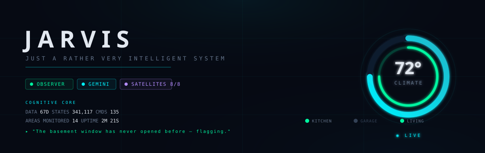
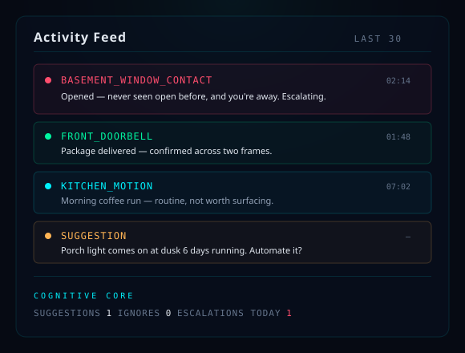
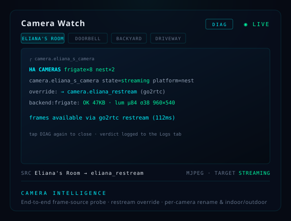

<div align="center">

# JARVIS AI Assistant

### *Just A Rather Very Intelligent System*

An autonomous AI butler for Home Assistant — voice, vision, and a reasoning core that learns your home and watches over it.



[](https://github.com/sam3gp8/jarvis-aio)
[](https://github.com/sam3gp8/jarvis-aio/releases)
[](LICENSE)
[](https://www.buymeacoffee.com/sam3gp8)

</div>

---

JARVIS turns Home Assistant into a proactive household intelligence. It speaks in a custom voice, sees through your cameras, reasons about what's worth telling you, and quietly learns the rhythms of your home over weeks and months. It installs as a Home Assistant **custom integration** via HACS and runs entirely inside Home Assistant — no separate container.

The guiding principle is **suggest, don't act** until you grant otherwise: JARVIS starts conservative, surfaces what it notices, and expands its autonomy only as you allow.

## Quick start (5 minutes, no cameras required)

JARVIS looks elaborate, but the floor is low — you can be talking to it in five minutes with nothing but Home Assistant and one free API key. Cameras, voice hardware, and local GPU inference are all **optional** upgrades you add later.

1. **Install via HACS** — add this repo ([badge below](#installation)), install "JARVIS AI Assistant," restart Home Assistant.
2. **Add the integration** — *Settings → Devices & Services → Add Integration → JARVIS*. Paste a [Groq API key](https://console.groq.com) (free tier, generous) — or leave it blank and point it at a local Ollama URL to run with no cloud account at all.
3. **That's it.** JARVIS registers its conversation agent and appears in your sidebar. Ask it about your home, your calendar, or the outside world.

Everything past this point — vision, doorbell analysis, the Iron Man HUD's live floor plan, proactive safety — layers on top as you connect cameras and voice. Nothing below is required to start. Jump to [Installation](#installation) for the full walkthrough.

## What it does

**Voice & conversation.** A pluggable LLM brain (Groq, Gemini, OpenAI, Anthropic, or a local Ollama server) drives natural conversation through the Home Assistant voice pipeline, answered in a custom Piper TTS voice. Works with ESP32-S3 satellites, Wyoming, and Google speakers.

**Web research & schedule awareness.** Ask JARVIS about the outside world — current events, facts, "what's the latest on…" — and it looks it up (DuckDuckGo Instant Answer out of the box, no API key; point it at a self-hosted SearXNG for richer results). It also reads your household `calendar.*` entities to surface upcoming events and flag scheduling conflicts — overlaps, and back-to-back commitments with too little gap between them.

**Answers from your own paperwork.** Drop appliance manuals and receipts (PDF, `.txt`, `.md`) into `/config/jarvis/documents`, and JARVIS ingests and chunks them. Then ask "what's the filter size for the furnace?" or "when did we buy the dishwasher?" and it answers from your documents, citing the source. Retrieval works by keyword out of the box; if you run Ollama, flip on **semantic search** and JARVIS embeds your documents via your Ollama server (`nomic-embed-text`) and stores the vectors in its own database — meaning-based matching with no ChromaDB and nothing extra to install.

**The JARVIS voice.** Modelled on Stark's JARVIS: dry, precise, unflappable, quietly witty — and strictly situational about it. The wit is a scalpel, not a hammer, and it goes silent the instant something is wrong. JARVIS does not quip during a smoke alarm. A **banter level** setting (plain / dry / full) tunes how much character surfaces, and urgent and grave events always speak plainly regardless.

**Vision & cameras.** Automatic doorbell-press analysis with a two-pass live-clip / recorded-event approach, package and mail detection on porch cameras, and silent visitor learning that quietly builds a picture of who comes and goes — all powered by vision models reasoning over Nest and Frigate feeds.

**The Cognitive Core.** A reasoning loop that classifies every household event by urgency and decides whether it's worth your attention. It grounds decisions in your home's actual history ("the kitchen light at 7am is routine; the basement window has never opened before"), escalates security-relevant events when you're away, and proposes automations from patterns it observes.

**The Local Mind.** When the cloud is unreachable, JARVIS doesn't go dumb — an offline reasoning brain replicates the full decision procedure (self-awareness, historical grounding, case-based memory, situational judgment, persona phrasing) so it keeps making sound, well-spoken calls with no internet at all.

**Safety & security.** Proactive monitoring for freezing pipes, smoke/CO/water, unauthorized entry, and nighttime lockdown — occupancy-gated so enforcement only happens when it should.

**An Iron Man HUD dashboard.** A dark-cyan glassmorphism control panel with a live isometric 3D house, per-room occupancy glow, radial telemetry gauges, an event feed, a doorbell-training view, and surfaced automation suggestions.

<div align="center">
<table border="0">
<tr>
<td width="50%"></td>
<td width="50%"></td>
</tr>
<tr>
<td align="center"><em>The Cognitive Core classifies every event by urgency — escalating the anomalous, muting the routine.</em></td>
<td align="center"><em>Camera intelligence: per-camera diagnostics, go2rtc restream override, rename &amp; indoor/outdoor designation.</em></td>
</tr>
</table>

<sub>Visuals reflect the panel's actual design system. The live dashboard renders in your browser inside Home Assistant.</sub>
</div>

## Full capability reference

Everything JARVIS can do today, by domain. In conversation these surface as
tools the agent invokes on its own; most also have a panel control.

**Conversation & delegation**
- Natural voice/text conversation through the Home Assistant pipeline, in the MCU-JARVIS persona with a tunable banter level.
- **Ephemeral sub-agents** (`delegate_task`) — for a complex, self-contained slice of a request, JARVIS spins up a focused in-process sub-agent with a minimal objective, a curated read-only tool subset, and a small turn budget, then folds the result back. Sub-agents can't actuate or recurse; depth is capped. On a single-GPU host they run serially, so the win is a tight focused context, not parallelism.

**Devices, scenes & home state**
- Control one device or many at once, run scenes and scripts, and execute multi-step plans (`control_device`, `bulk_control`, `run_scene_or_script`, `execute_plan`).
- Query live state, search entities, list a room's devices, and summarize the whole home (`get_entity_state`, `search_entities`, `get_area_devices`, `get_home_summary`).
- Read Home Assistant's recorded history and logbook — "what happened while I was out" (`activity_history`).

**Schedule & communications**
- Read household `calendar.*` entities, surface upcoming events, and flag overlaps and tight back-to-back transitions (`calendar_agenda`).
- **Read-only email** (`read_email`) — check the inbox over IMAP, read-only by construction (opens with EXAMINE, fetches with BODY.PEEK, never marks/moves/deletes); fetched mail is sanitized and treated as untrusted. The password lives in `secrets.yaml`.
- Scheduled morning/evening **briefings** — weather, calendar, overnight events, energy, and active hazards, occupancy-gated.

**Web & your documents**
- Look up the outside world (`web_research`) — DuckDuckGo out of the box, or a self-hosted SearXNG.
- Answer from your own manuals and receipts (`search_documents`, `ingest_documents`) — keyword out of the box, or Ollama-embedded semantic search.

**Cameras & vision**
- Look at a camera on demand and describe it (`look_at_camera`); report who's recognized at the door (`who_do_you_see`).
- Automatic doorbell-press analysis, package/mail detection, and silent visitor learning over Nest and Frigate feeds.

**Awareness, diagnostics & energy**
- Report the cognitive core's state, connectivity, and a full self-diagnostic (`cognitive_status`, `connectivity_status`, `system_diagnostics`); reason about the root cause of a fault (`root_cause`).
- Whole-home energy: current draw, peak awareness, and load advice with tunable agency (`energy_status`).

**Weather & hazards**
- Local forecast (`weather_forecast`) and a live multi-hazard report — nearby earthquakes (USGS), severe weather (NWS), and disasters (NASA EONET) (`hazard_report`).

**Safety & security**
- Proactive monitoring for freezing pipes, smoke/CO/water, unauthorized entry, and nighttime lockdown — occupancy-gated so enforcement only happens when it should.
- Confirm or dismiss intrusion events and acknowledge alerts by voice (`dismiss_intrusion`, `acknowledge_alert`); optional voice-confirmation before sensitive actions like unlocking.

**Modes, memory, goals & suggestions**
- Set operational modes, including custom ones (`set_mode`), and tune how much JARVIS acts on its own (`manage_autonomy`).
- Remember facts you tell it (`remember`); open and track standing goals (`create_goal`, `update_goal`, `manage_goals`) and schedule follow-ups (`schedule_followup`, `manage_followups`).
- Review, approve, or dismiss the automations it proposes from observed patterns (`review_suggestions`, `approve_suggestion`, `dismiss_suggestion`).
- Mute a noisy entity from awareness, or force it back in (`ignore_entity`, `unignore_entity`); read opt-in wearable/wellbeing context (`wellbeing_context`).

**Resilience & privacy**
- The **Local Mind** replicates the full decision procedure offline, so JARVIS stays sharp with no internet at all.
- All LLM credentials live in Home Assistant's `secrets.yaml`, never in plaintext panel config; any existing plaintext keys are relocated automatically and safely (verify-before-strip) on upgrade.
- A single config resolver makes the panel the one source of truth for which model every part of JARVIS runs.

## Requirements

**To start, you need exactly two things:**

- **Home Assistant** with [HACS](https://hacs.xyz) installed.
- **One LLM API key** — [Groq](https://console.groq.com) has a generous free tier and is the recommended starting point (or run fully local with Ollama, no key at all).

**Optional add-ons** (each unlocks more, none required to begin):

- *Voice* — HA OS / Supervised recommended; JARVIS auto-installs the Piper / Whisper / openWakeWord voice stack via the Supervisor. On Container/Core you'd add those yourself.
- *Vision* — a Gemini API key for camera reasoning, plus cameras. Any HA camera works; **Frigate** is the recommended backbone (detection + snapshots), and Nest cameras/doorbells are supported through it.
- *Voice hardware* — ESP32-S3 satellites and a Piper TTS voice.
- *Fully local inference* — a GPU box running Ollama; point `llm_base_url` at it and JARVIS runs entirely on your own hardware, no cloud account.

## Installation

**1. Add this repository to HACS.**

[](https://my.home-assistant.io/redirect/hacs_repository/?owner=sam3gp8&repository=jarvis-aio&category=Integration)

Click the badge above, or do it manually — in **HACS → ⋮ (top right) → Custom repositories**, add the URL below with category **Integration**:

```
https://github.com/sam3gp8/jarvis-aio
```

**2. Install "JARVIS AI Assistant"** from HACS, then restart Home Assistant.

**3. Add the integration.** Go to **Settings → Devices & Services → Add Integration → JARVIS**. Enter a cloud API key (e.g. Groq), *or* leave it blank and enter a local LLM URL (e.g. `http://homeassistant.local:11434/v1`) to run Ollama with no cloud account. JARVIS registers its conversation agent and appears in the sidebar.

**4. Set up voice (optional).** On Home Assistant OS / Supervised, JARVIS bootstraps the voice stack itself on first run — it installs and starts the **Piper**, **Whisper**, and **openWakeWord** add-ons, downloads the JARVIS voice, and creates an Assist pipeline with JARVIS as the conversation agent. On Container/Core installs (no Supervisor), install those pieces yourself and create the pipeline via Settings → Voice Assistants.

**5. Fine-tune (optional).** Advanced routing, observer mode, camera watching, and the AI-model-per-role assignments are all configured from the JARVIS panel → **Settings**.

> **Hard-refresh after updates.** The dashboard JavaScript is cached aggressively — after upgrading, refresh with `Ctrl+Shift+R` so the new panel loads.

## Advanced setup — cameras & continuous streaming

*Everything in this section is optional.* You need it only for the vision features (doorbell analysis, package detection, the HUD's live camera tiles). Skip it entirely if you're starting with voice and reasoning — you can come back when you want cameras.

### How JARVIS uses cameras

JARVIS doesn't require any *specific* camera brand — it works with **any camera Home Assistant exposes** as a `camera.*` entity, pulling stills via the standard image API. But it's built to lean on **[Frigate](https://frigate.video)** as the backbone, and that's the recommended setup:

- **Frigate is the funnel.** Its on-camera object detection for people and packages (fired over MQTT) is far more reliable than a vision model guessing at a raw feed, and its event snapshots are high-resolution and cropped to the detection. JARVIS listens to `frigate/events`, consumes those snapshots directly, and its face recognition reads Frigate's `tracked_object_update` / `last_recognized_face` channels. If you run cameras at all, running them through Frigate is what makes the vision features sharp.
- **Nest is a supported source, not a requirement.** JARVIS can consume Nest cameras and doorbells too — but Google's cameras need extra plumbing (below) because of how their stream API behaves. If you have Nest gear, route it *into* Frigate via go2rtc and you get the best of both: Nest's doorbell events plus Frigate's detection and durable frames.
- **Any other camera** (generic RTSP, local ONVIF, etc.) works via the standard snapshot path with no special setup — add it to Frigate for detection, or let JARVIS pull stills directly.

The rest of this section is the **Nest-specific** setup. If you don't use Nest, you can skip it entirely — point Frigate at your cameras and you're done.

### Nest cameras (only if you use Nest)

JARVIS consumes Nest cameras and doorbells **through the official [Google Nest integration](https://www.home-assistant.io/integrations/nest/)** — it does not (and legally cannot) talk to Google's Smart Device Management API with its own credentials, because Google binds SDM access to *your* Google account and Device Access project. One-time setup:

1. **Google SDM API** — create a project in the [Device Access Console](https://console.nest.google.com/device-access) (US $5 one-time fee) and a Google Cloud project with the SDM API enabled and OAuth credentials.
2. **Credentials in HA** — add your OAuth Client ID + Secret under *Settings → Devices & Services → Application Credentials*, then add the **Google Nest** integration and authorize it. Your cameras and doorbell appear as `camera.*` entities.
3. **That's it for JARVIS** — it auto-detects Nest-platform cameras and uses the right frame source for each event (event media, stream-wake, or its own snapshot path). Battery/WebRTC-only Nest cameras can't produce ordinary still images while idle; the JARVIS panel handles this automatically by escalating to its own snapshot tier, so the tile shows frames instead of going blank.

### Continuous streaming for Nest cameras (recommended if you use Nest)

Google's SDM API hands out **WebRTC/RTSP stream URLs that expire every ~5 minutes** and won't reliably produce a still image while a camera is idle. That's fine for the occasional glance, but it means live tiles can stall and 24/7 NVR recording (Frigate) chokes. The durable fix — and the one JARVIS is built to lean on — is to **restream each Nest camera through [go2rtc](https://github.com/AlexxIT/go2rtc)**, which speaks Google's SDM protocol natively, transparently renews the expiring stream, and republishes a rock-solid RTSP/WebRTC feed that Home Assistant, Frigate, and JARVIS all consume like any local camera. **If you already run Frigate, you already have a go2rtc instance — it's bundled** — which is the other reason Frigate is the recommended backbone: it's doing double duty as both your detector and your Nest restreamer.

**1. Point go2rtc at your Nest account.** In your go2rtc (or Frigate) config, add a `nest:` source per camera. You need five values, all from the same Device Access setup you did above:

```yaml
go2rtc:
  streams:
    eliana_restream:
      - "nest:?client_id=CLIENT_ID&client_secret=CLIENT_SECRET&refresh_token=REFRESH_TOKEN&project_id=DEVICE_ACCESS_PROJECT_ID&device_id=DEVICE_ID"
    front_doorbell_restream:
      - "nest:?client_id=CLIENT_ID&client_secret=CLIENT_SECRET&refresh_token=REFRESH_TOKEN&project_id=DEVICE_ACCESS_PROJECT_ID&device_id=DOORBELL_DEVICE_ID"
```

- `client_id` / `client_secret` — the same OAuth pair you added under *Application Credentials*.
- `project_id` — the **Device Access Console** project UUID (not the Google Cloud project).
- `refresh_token` — from the Nest integration's stored config: in *Settings → Add-ons → File editor* (or SSH), open `.storage/core.config_entries`, find the `nest` entry, copy its `refresh_token`.
- `device_id` — easiest via the **go2rtc web UI** (Frigate exposes it on port `1984`): *Add → nest*, supply the other four values, and it lists your devices with their IDs. Copy the one you want.

**2. (Optional) add the restreams as Frigate cameras.** If you want continuous recording and object detection, add each `*_restream` as a Frigate camera and enable `detect`/`record`. Frigate's on-camera object detection for people and packages is more reliable than vision-LLM guessing, and JARVIS will happily consume Frigate's snapshots.

**3. Tell JARVIS to source frames from the twins.** Restart Home Assistant so the new `camera.*_restream` entities exist, then map each Nest camera to its restream in JARVIS's config (`camera_overrides`). The Nest entity keeps its identity — chips, names, doorbell **events** — while every *frame* comes from the durable restream:

```json
{
  "camera_overrides": {
    "camera.eliana_s_camera": "camera.eliana_restream",
    "camera.front_doorbell": "camera.front_doorbell_restream"
  }
}
```

This lives in `/config/jarvis/config.json` (merge it into the existing object — don't replace the file). JARVIS validates this on load, so a typo is sidelined with a notification rather than breaking the panel. Then open **Camera Watch → DIAG** on the camera: it should report `override → camera.eliana_restream` and a healthy full-size frame instead of a blank or black tile.

> **Note:** go2rtc's Nest source is a third-party bridge and Google occasionally changes its auth behavior. If a restream ever drops, JARVIS automatically falls back to the original Nest entity — worst case is the pre-restream behavior, never worse.

## Configuration highlights

| Setting | What it does |
| --- | --- |
| `llm_provider` / per-role models | Choose Groq, Gemini, OpenAI, Anthropic, Ollama, or custom — independently for the main agent, classifier, reasoning, review, vision, and camera-reasoning roles. |
| `llm_base_url` | Point the Ollama/custom providers at your local GPU server (e.g. `http://gpu-server:11434/v1`). |
| `observer_enabled` | Let JARVIS watch the event stream and decide what's worth surfacing. |
| `rich_reasoning` | Cloud-first judgment for medium/high-urgency events (cheap, sharper). |
| `visitor_learning` | Silently learn from person events at the door — never spoken. |
| `package_detection` | Watch porch cameras for packages and mail. |
| `cognition_threshold` | How salient an event must be before JARVIS escalates it. |

## Languages

JARVIS follows your Home Assistant language automatically, and you can override it in **Settings → General → Language** (or leave it on *Auto*). The setup and configuration dialogs are localized through Home Assistant's own translation system; the in-panel HUD is localized by JARVIS. Anything not yet translated falls back cleanly to English, so nothing ever breaks.

**Fully translated (panel + setup dialog):** French, German, Spanish, Italian, Portuguese, Dutch.

**Core UI translated (expanding):** Polish, Russian, Ukrainian, Czech, Slovak, Swedish, Danish, Norwegian, Finnish, Turkish, Romanian, Brazilian Portuguese.

### Help translate

Translations are plain JSON files — no code required:

- **Panel UI:** `custom_components/jarvis/frontend/i18n/<lang>.json`, keyed by the exact English string.
- **Setup dialog:** `custom_components/jarvis/translations/<lang>.json` (Home Assistant's format).

To add a language or refine an existing one, copy an existing file, translate the values, and keep the keys and technical tokens (entity IDs, model names, URLs) unchanged. **Corrections and new languages are very welcome** — especially native-speaker fixes to the machine-assisted translations, and languages not yet listed. Right-to-left languages (Arabic, Hebrew, …) also need panel layout support, so that's a great area to help with.

## Architecture

JARVIS is a **Home Assistant custom integration** (domain `jarvis`, ~86 Python modules) installed via HACS into `custom_components/jarvis/`. It runs in-process: it registers the conversation agent and voice pipeline and serves the custom dashboard panel directly. State and learned behavior persist under `/config/jarvis/` (a SQLite `patterns.db`, the curated `knowledge.db`, the reasoning cache, the doorbell-training dataset, and lockdown state) so JARVIS keeps getting smarter across restarts.

The reasoning pipeline is layered for resilience and cost: local templates → learned cache → (cloud, or soon a local model) → the **Local Mind** offline brain as the floor beneath everything. A connectivity breaker guards cloud calls, and every local decision logs its reasoning chain to the dashboard's log view.

## Privacy & your data

JARVIS is **local-first**. Everything it learns and stores lives inside your Home Assistant instance under `/config/jarvis/` — there is no JARVIS cloud, no telemetry, and nothing is sent anywhere except the LLM/vision calls you configure.

What's stored, and where:

- **Learned behavior & patterns** — `patterns.db` (state changes and commands used to propose automations), `person_patterns` (per-person routines), and the reasoning cache. All local SQLite.
- **Knowledge & memory** — the curated `knowledge.db` and conversation memory (vectors or FTS), local SQLite. Editable and erasable from the dashboard.
- **Documents** — anything you drop in `/config/jarvis/documents` for the RAG agent, plus its index/vectors. Ingestion is path-guarded so it only ever reads inside that folder.
- **Camera & vision** — snapshots are analyzed on demand and not retained by JARVIS; recording is Frigate's job, under your control.
- **Biometrics** — **off by default and opt-in.** When enabled, JARVIS *reads* wearable entities Home Assistant already exposes for comfort context (e.g. being quieter when a sleep sensor says you're resting). It does not copy, store, or transmit health data, and it is explicitly **not medical** — it never diagnoses, alarms on, or clinically interprets a reading; anything concerning is deferred to your own device or a medical professional.

What leaves your network is only what you choose: requests to whichever LLM provider (Groq/OpenAI/Anthropic) and vision model you configure, or nothing at all if you run everything locally through Ollama. Swap any provider for a local model to keep the whole pipeline on-premises. Sensitive integration credentials are held by Home Assistant, not JARVIS.

## Support

If JARVIS makes your home a little smarter, you can support continued development:

<a href="https://www.buymeacoffee.com/sam3gp8"></a>

Bugs and feature requests go to [GitHub Issues](https://github.com/sam3gp8/jarvis-aio/issues). Contributions are welcome — see [CONTRIBUTING.md](CONTRIBUTING.md).

## License

[MIT](LICENSE) © sam3gp8

<sub>Inspired by the JARVIS of the Marvel Cinematic Universe. This is an independent project, not affiliated with or endorsed by Marvel or Disney.</sub>
